# How claudette-agent Works

This document explains the internal architecture and design of claudette-agent, a Claudette-compatible wrapper for the Claude Agent SDK.

## Architecture Overview

```mermaid
graph TB
    subgraph "User Code"
        UC[User Application]
    end

    subgraph "claudette-agent"
        CA[Chat / AsyncChat]
        CL[Client / AsyncClient]
        CORE[core.py<br/>Types & Utilities<br/>Shared Parsers]
        TOOLS[tools.py<br/>Tool Support]
        STRUCT[structured.py<br/>Native + Legacy<br/>Structured Outputs]
        STREAM[streaming.py<br/>StreamEvent-based<br/>Streaming]
        MCP[mcp.py<br/>MCP Integration]
        TE[text_editor.py<br/>File Operations]
    end

    subgraph "Claude Agent SDK"
        SDK[ClaudeSDKClient]
        QUERY[query()]
        MCPS[MCP Servers]
        SE[StreamEvent]
        RM[ResultMessage]
    end

    UC --> CA
    UC --> CL
    CA --> CL
    CA --> TOOLS
    CL --> CORE
    CL --> SDK
    CL --> QUERY
    TOOLS --> MCP
    TOOLS --> MCPS
    STRUCT --> CA
    STREAM --> QUERY
    STREAM --> SE
    STREAM --> RM
```

## Core Components

### 1. Client Layer

The `Client` and `AsyncClient` classes provide the low-level interface to the Claude Agent SDK.

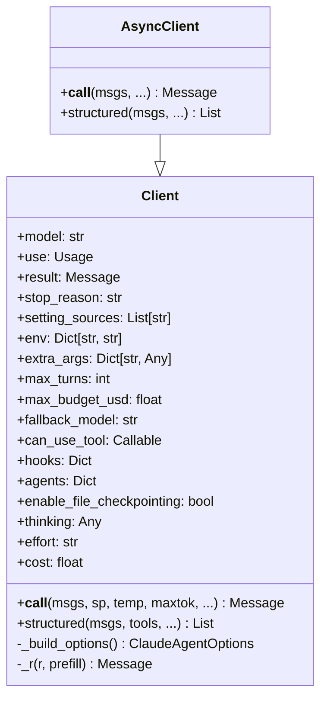

### 2. Chat Layer

The `Chat` and `AsyncChat` classes maintain conversation history and provide tool support.

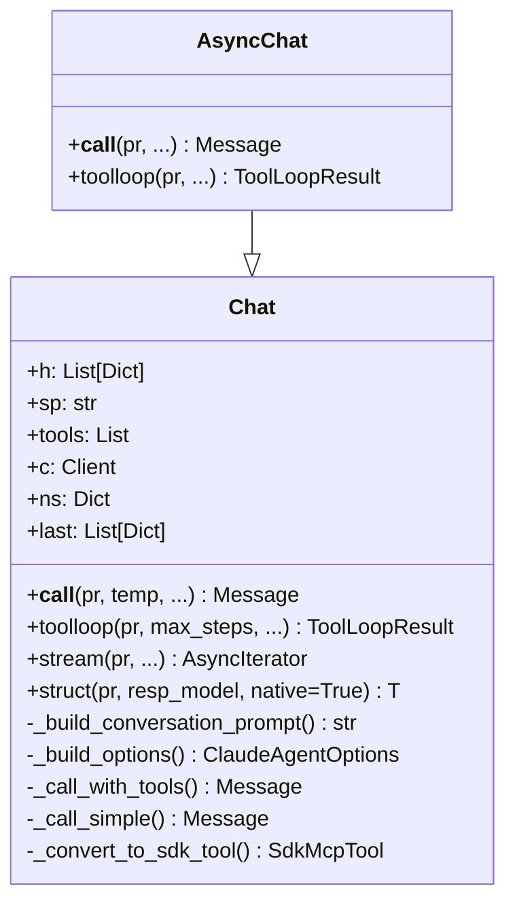

## Message Flow

### Simple Query (No Tools)

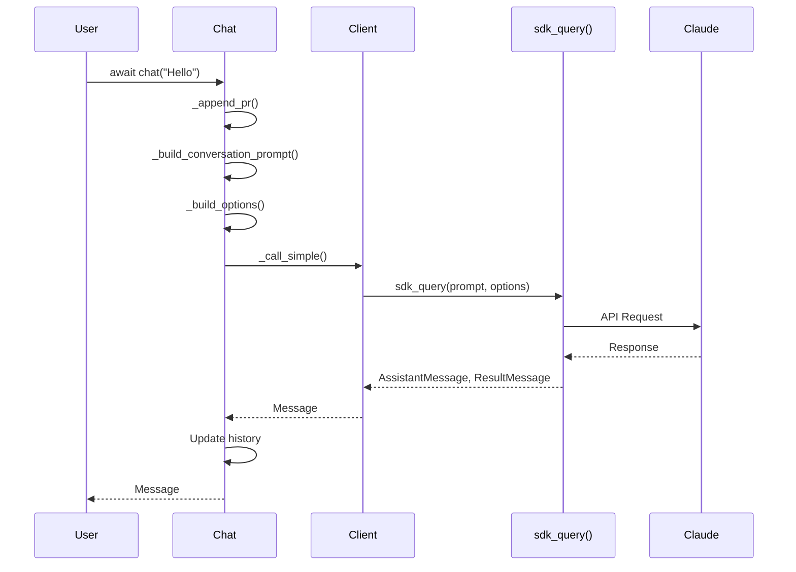

### Streaming Query

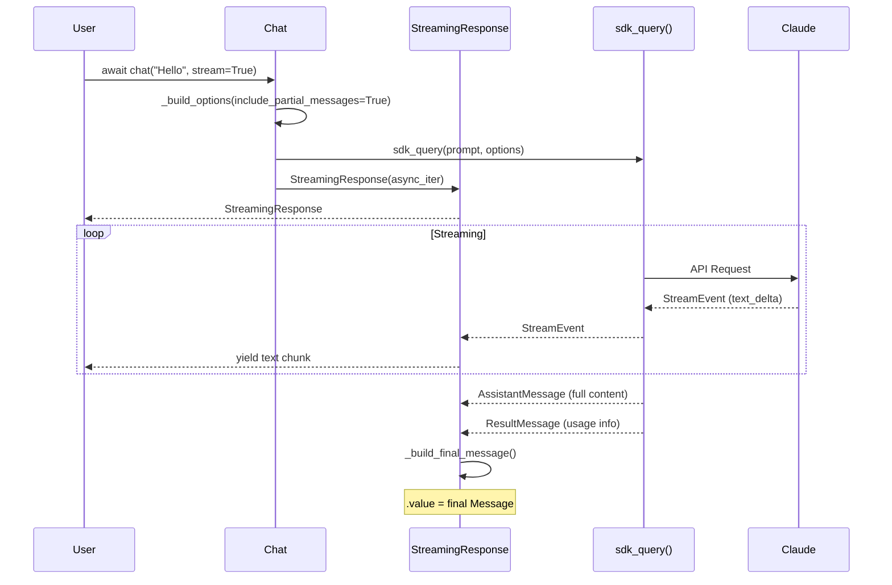

### Query with Tools

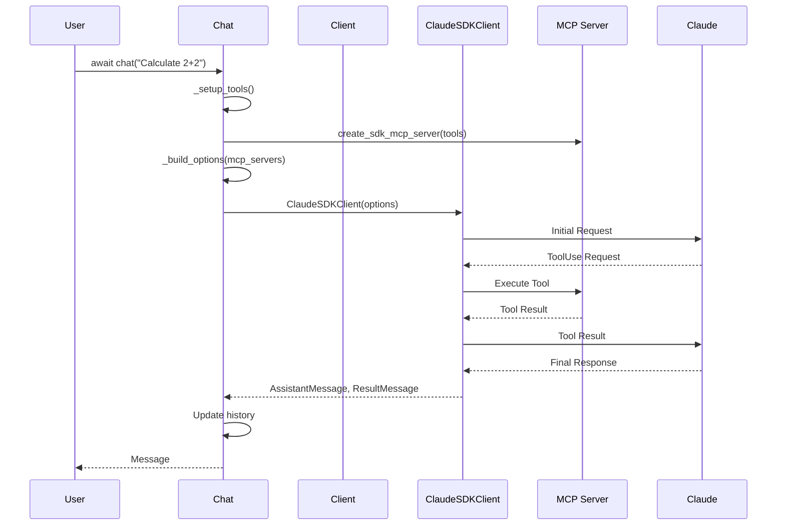

## Streaming Architecture

Streaming uses the SDK's `include_partial_messages=True` option to receive `StreamEvent` objects with `text_delta` for real character-by-character streaming (matching claudette behavior).

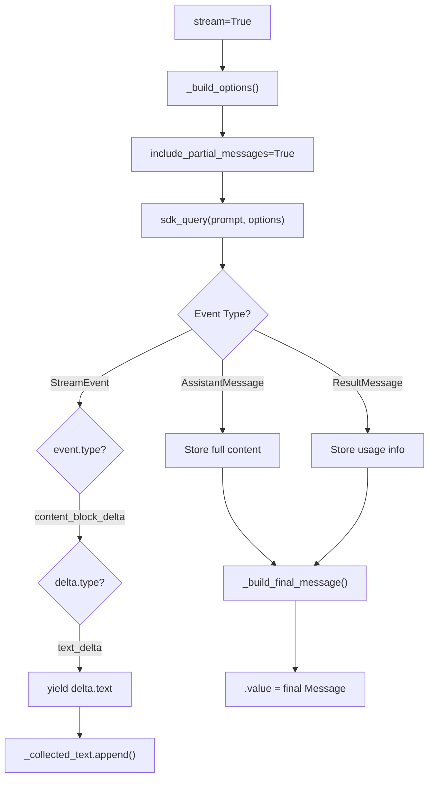

### StreamEvent Processing

The `StreamingResponse` class processes three types of items from the SDK async iterator:

1. **`StreamEvent`** — Raw Claude API events. Filters for `content_block_delta` → `text_delta` and yields the text.
2. **`AssistantMessage`** — Complete message with all content blocks. Used as fallback if no `StreamEvent` received.
3. **`ResultMessage`** — Usage and cost information. Extracted for the final `Message`.

### Streaming + Thinking Validation

Using `stream=True` with `maxthinktok > 0` raises a `ValueError` since the SDK does not support streaming with extended thinking.

## Extended Thinking

Extended thinking uses the SDK's native `max_thinking_tokens` option (with forward compatibility for `ThinkingConfig`):

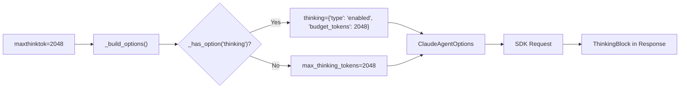

The `_has_option()` helper provides forward compatibility by introspecting `ClaudeAgentOptions` fields at runtime:

```python
def _has_option(name: str) -> bool:
    """Check if ClaudeAgentOptions supports a given field."""
    if not SDK_AVAILABLE: return False
    import dataclasses
    return name in {f.name for f in dataclasses.fields(ClaudeAgentOptions)}
```

The `thinking` init parameter also accepts direct config dicts:

```python
# Adaptive thinking (future SDK support)
Client(thinking={"type": "adaptive"})
# Explicit budget
Client(thinking={"type": "enabled", "budget_tokens": 4096})
```

## Structured Outputs

Two approaches are supported, letting the user choose:

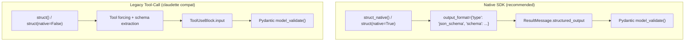

### Native SDK Approach (`struct_native`)

Uses `ClaudeAgentOptions.output_format` with a JSON Schema derived from the Pydantic model. The SDK validates the output and returns it via `ResultMessage.structured_output`.

```python
# Automatic via Chat
person = await chat.struct("Extract: John is 25", Person, native=True)

# Direct on Client
person = await client.struct_native(msgs, Person)
```

### Legacy Tool-Call Approach

Uses prompt engineering with tool forcing to extract structured data from `ToolUseBlock.input`. This is the original claudette approach.

```python
person = await chat.struct("Extract: John is 25", Person, native=False)
```

## System Prompt Presets

The `sp` parameter accepts both strings and dicts for SDK preset system prompts:

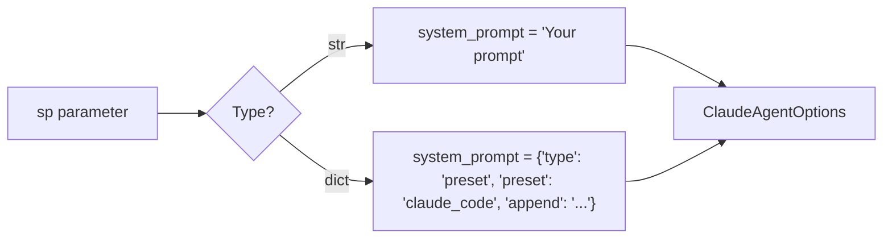

## Tool Loop

The `toolloop()` method handles multi-step tool execution:

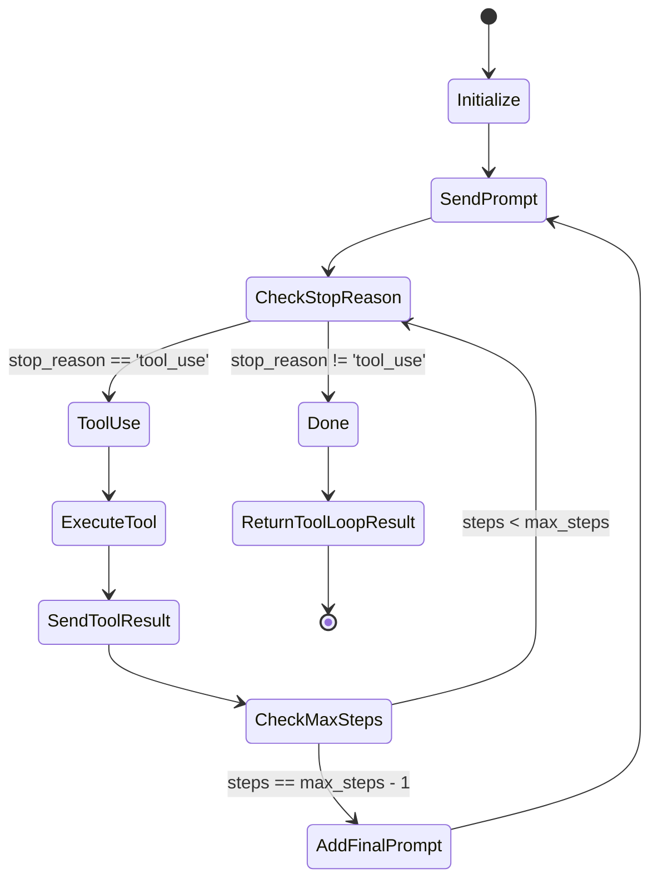

## Image Processing

Images are processed in `mk_msg()`:

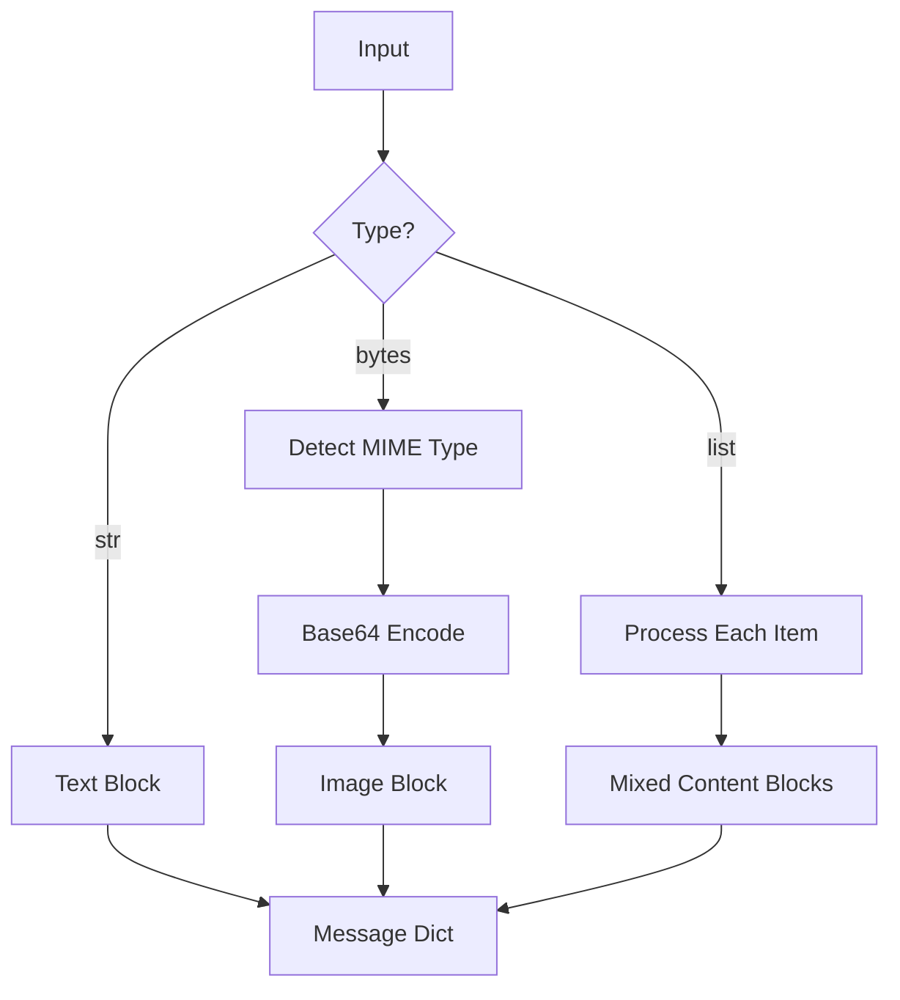

## Text Editor Tool

The text editor provides file manipulation operations:

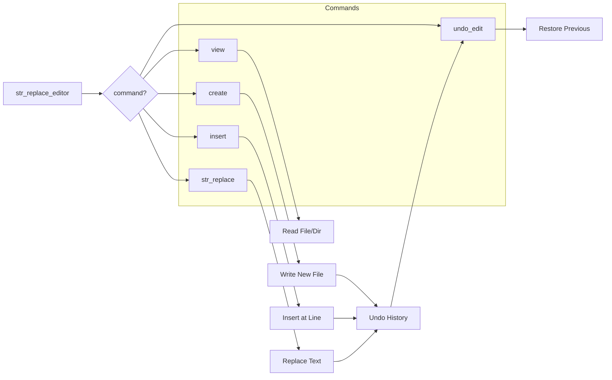

## Key Design Patterns

### 1. Dual Path Architecture

Chat uses different code paths depending on whether tools are needed:

- **With Tools**: Uses `ClaudeSDKClient` with MCP servers
- **Without Tools**: Uses simple `sdk_query()` for efficiency

### 2. SDK Message Extraction

The SDK returns different message types. Shared parsers in `core.py` handle all conversions:

- `AssistantMessage`: Contains response content → parsed by `_parse_sdk_message()`
- `ResultMessage`: Contains usage and cost information → parsed by `_parse_usage()`
- `StreamEvent`: Contains raw API events → processed by `StreamingResponse`

```python
async for msg in sdk_query(...):
    if isinstance(msg, ResultMessage):
        usage = _parse_usage(msg.usage)
    elif isinstance(msg, AssistantMessage):
        message = _parse_sdk_message(msg)
    elif isinstance(msg, StreamEvent):
        # Character-level streaming (when include_partial_messages=True)
        event = msg.event
        if event.get('type') == 'content_block_delta':
            delta = event.get('delta', {})
            if delta.get('type') == 'text_delta':
                yield delta['text']
```

### 3. Shared Parsing Functions (`core.py`)

To eliminate duplication between `client.py` and `chat.py`, shared parsing functions live in `core.py`:

- `_parse_usage(u)` — Converts SDK usage (dict or object) to `Usage` namedtuple
- `_parse_sdk_message(msg)` — Converts `AssistantMessage` to our `Message` format
- `_simple_text_message(text)` — Creates a simple `Message` with a `TextBlock`

### 4. Forward-Compatible SDK Feature Detection

The `_has_option()` helper introspects `ClaudeAgentOptions` at runtime to check for SDK features that may not yet be available:

```python
def _has_option(name: str) -> bool:
    """Check if ClaudeAgentOptions supports a given field."""
    import dataclasses
    return name in {f.name for f in dataclasses.fields(ClaudeAgentOptions)}
```

This enables forward compatibility — e.g., `thinking` config and `effort` level are used when the SDK supports them, otherwise fallback to `max_thinking_tokens`.

### 5. Tool Wrapping

Python functions are converted to SDK-compatible tools:

```mermaid
flowchart LR
    A[Python Function] --> B[@tool decorator]
    B --> C[Extract Signature]
    C --> D[Build Schema]
    D --> E[sdk_tool wrapper]
    E --> F[MCP Server]
```

Pre-created `SdkMcpTool` instances are passed through directly (no re-wrapping).

### 6. Mixin Pattern

Structured output support is added via mixins:

```python
class StructuredMixin:
    async def struct(self, msgs, resp_model, ...):
        # Implementation

add_struct_to_chat(Chat)  # Adds .struct() and .struct_native() methods
```

## File Structure

```
claudette_agent/
├── __init__.py      # Public API exports + session management re-exports
├── core.py          # Types, utilities, constants, shared parsers
├── client.py        # Client & AsyncClient (with _has_option helper)
├── chat.py          # Chat & AsyncChat
├── tools.py         # Tool support & MCP
├── structured.py    # Native SDK + legacy structured outputs
├── streaming.py     # StreamEvent-based streaming
├── mcp.py           # MCP server config
└── text_editor.py   # Text editor tool
```

## Stateless Mode

By default, claudette-agent runs in stateless mode, meaning each query is independent. This is achieved through multiple mechanisms:

```mermaid
flowchart TB
    subgraph "Stateless Mechanisms"
        A[setting_sources=[]] --> E[No settings loaded]
        B[continue_conversation=False] --> F[Don't continue recent conversation]
        C[resume=None] --> G[Don't resume previous session]
        D[optional: env/extra_args] --> H[Isolate CLI process]
    end

    subgraph "Result"
        E --> I[Independent Queries]
        F --> I
        G --> I
        H --> I
    end
```

### Built-in Stateless Options

The `_build_options()` method explicitly sets stateless parameters:

```python
opts = {
    'system_prompt': sp,
    'setting_sources': self.setting_sources,  # [] for stateless by default
    'continue_conversation': False,  # Don't continue most recent conversation
    'resume': None,  # Don't resume any previous session
    # ... other options
}
ClaudeAgentOptions(**opts)
```

### Stateless Configuration Options

| Parameter | Default | Effect |
|-----------|---------|--------|
| `setting_sources=[]` | Yes | No settings loaded from filesystem |
| `continue_conversation=False` | Yes | Don't continue the most recent conversation |
| `resume=None` | Yes | Don't resume any previous session ID |
| `env={'HOME': ...}` | No | Isolate CLI config directory (optional, for maximum isolation) |
| `extra_args={'no-session-persistence': None}` | No | Disable session persistence (optional) |

## Environment Variables (`env`)

The `env` parameter allows passing custom environment variables to the Claude CLI process:


This is particularly useful for achieving true statelessness by isolating the Claude CLI's configuration directory:

```python
import tempfile

# Create unique temp directory for this query
unique_dir = tempfile.mkdtemp()

# Pass HOME to isolate ~/.claude/ directory
chat = Chat(
    model='claude-sonnet-4-5-20250929',
    setting_sources=[],
    env={'HOME': unique_dir}  # Fresh ~/.claude/ per query
)
```

## Extra CLI Arguments (`extra_args`)

The `extra_args` parameter allows passing additional CLI arguments to `ClaudeAgentOptions`:

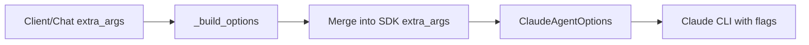

This is particularly useful for truly stateless queries by disabling session persistence:

```python
# Truly stateless: no settings + no session persistence
chat = Chat(
    model='claude-sonnet-4-5-20250929',
    setting_sources=[],  # Don't load settings
    extra_args={'no-session-persistence': None}  # Don't persist session
)
```

**Important**: Keys should NOT include the `--` prefix (SDK adds it internally):

```python
# Correct: SDK converts to --no-session-persistence
extra_args = {'no-session-persistence': None}

# For options with values
extra_args = {'model': 'claude-sonnet-4-5-20250929'}  # Becomes --model claude-sonnet-4-5-20250929
```

## New SDK Feature Parameters

These parameters are available on `Client`, `Chat`, and `AsyncChat`:

| Parameter | Type | Description |
|-----------|------|-------------|
| `max_turns` | `int` | Limit agentic turns (tool-use round trips) |
| `max_budget_usd` | `float` | Maximum budget in USD |
| `fallback_model` | `str` | Fallback model if primary fails |
| `can_use_tool` | `Callable` | Custom permission callback for tool use |
| `hooks` | `dict` | Hook configurations for intercepting events |
| `agents` | `dict` | Subagent definitions |
| `enable_file_checkpointing` | `bool` | Enable file change tracking |
| `thinking` | `dict` | Extended thinking config (forward-compatible) |
| `effort` | `str` | Effort level: "low"/"medium"/"high"/"max" (forward-compatible) |

All are passed through to `ClaudeAgentOptions` in `_build_options()`, with runtime feature detection via `_has_option()` for fields that may not yet exist in the installed SDK version.

## Feature Mapping: claudette → claudette-agent

| claudette Feature | claudette-agent Implementation |
|-------------------|-------------------------------|
| `Client.__call__()` | Uses `sdk_query()` |
| `Chat.__call__()` | Uses `sdk_query()` or `ClaudeSDKClient` |
| `toolloop()` | Returns `ToolLoopResult` with `.value` |
| `maxthinktok` | Via native `max_thinking_tokens` (or `thinking` config when SDK supports it) |
| `prefill` | Added to prompt as instruction |
| `cache` | Via `cache_control` in messages |
| `struct()` (native) | Via SDK `output_format` + `ResultMessage.structured_output` |
| `struct()` (legacy) | Via tool forcing + schema extraction |
| `stream` | Via `include_partial_messages=True` + `StreamEvent` text deltas |
| `sp` (preset) | Via dict `{"type": "preset", "preset": "claude_code", "append": "..."}` |
| `setting_sources` | Via `ClaudeAgentOptions.setting_sources` |
| `env` | Via `ClaudeAgentOptions.env` (merged with internal vars) |
| `extra_args` | Via `ClaudeAgentOptions.extra_args` (CLI argument passthrough) |
| `max_turns` | Via `ClaudeAgentOptions.max_turns` |
| `max_budget_usd` | Via `ClaudeAgentOptions.max_budget_usd` |
| `effort` | Via `ClaudeAgentOptions.effort` (forward-compatible) |
| `thinking` | Via `ClaudeAgentOptions.thinking` (forward-compatible) |
| Session management | `list_sessions()`, `get_session_messages()` re-exported from SDK |
