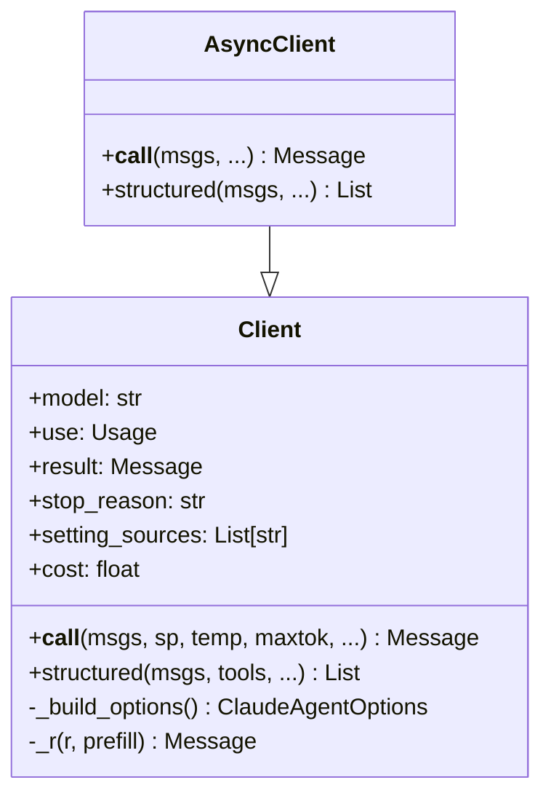
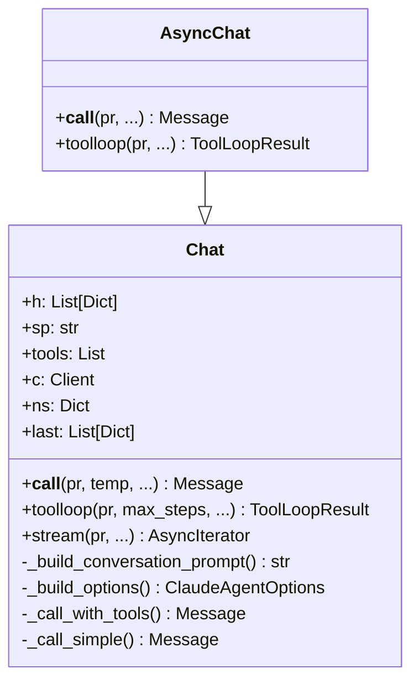
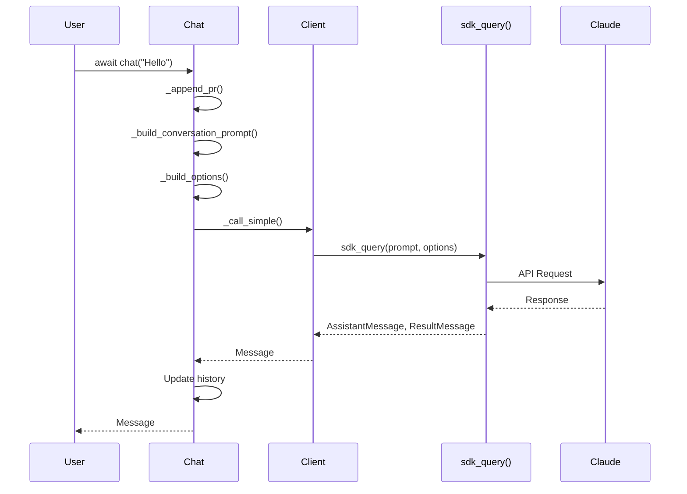
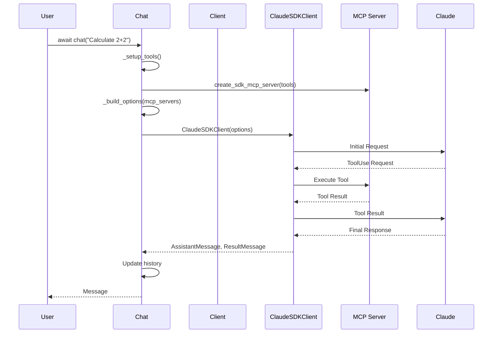
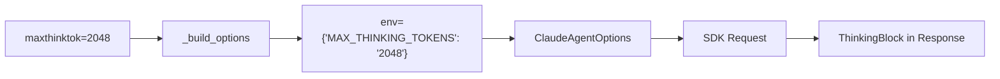
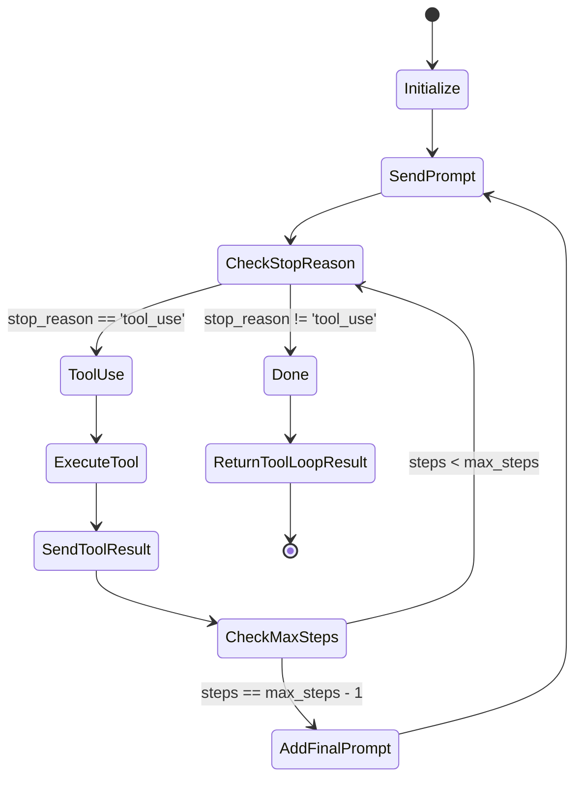
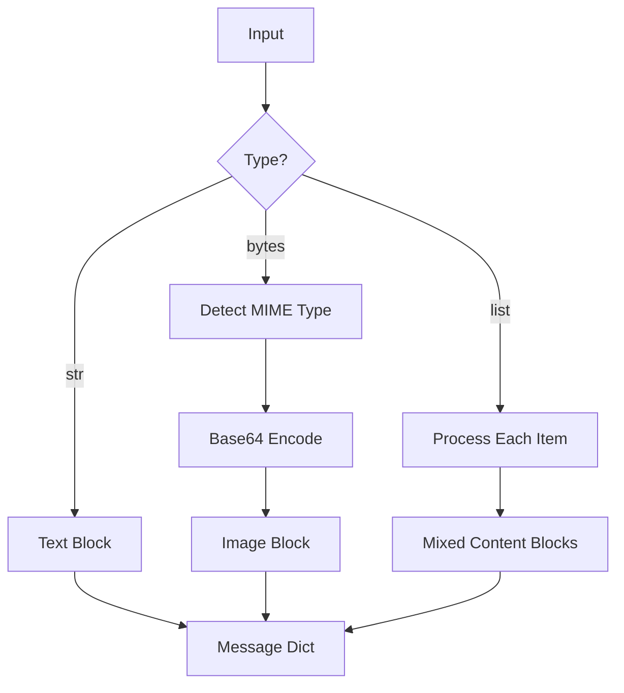
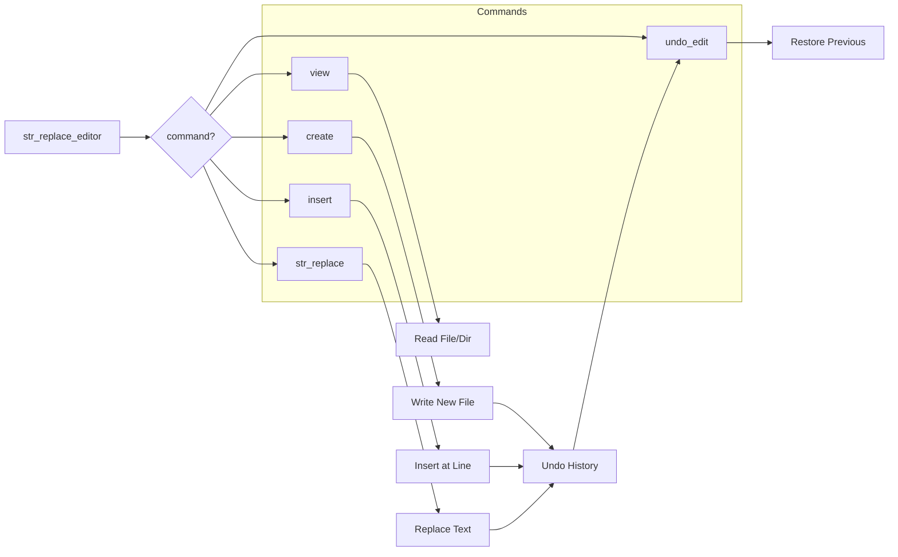
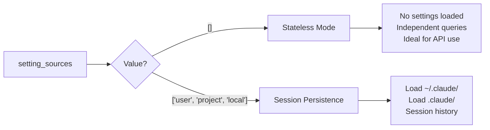

# How claudette-agent Works

This document explains the internal architecture and design of claudette-agent, a Claudette-compatible wrapper for the Claude Agent SDK.

## Architecture Overview

```mermaid
graph TB
    subgraph "User Code"
        UC[User Application]
    end

    subgraph "claudette-agent"
        CA[Chat / AsyncChat]
        CL[Client / AsyncClient]
        CORE[core.py<br/>Types & Utilities]
        TOOLS[tools.py<br/>Tool Support]
        STRUCT[structured.py<br/>Pydantic Support]
        STREAM[streaming.py<br/>Streaming]
        MCP[mcp.py<br/>MCP Integration]
        TE[text_editor.py<br/>File Operations]
    end

    subgraph "Claude Agent SDK"
        SDK[ClaudeSDKClient]
        QUERY[query()]
        MCPS[MCP Servers]
    end

    UC --> CA
    UC --> CL
    CA --> CL
    CA --> TOOLS
    CL --> CORE
    CL --> SDK
    CL --> QUERY
    TOOLS --> MCP
    TOOLS --> MCPS
    STRUCT --> CA
    STREAM --> QUERY
```

## Core Components

### 1. Client Layer

The `Client` and `AsyncClient` classes provide the low-level interface to the Claude Agent SDK.



### 2. Chat Layer

The `Chat` and `AsyncChat` classes maintain conversation history and provide tool support.



## Message Flow

### Simple Query (No Tools)



### Query with Tools



## Extended Thinking

Extended thinking is enabled via the `MAX_THINKING_TOKENS` environment variable in `ClaudeAgentOptions`:



## Tool Loop

The `toolloop()` method handles multi-step tool execution:



## Image Processing

Images are processed in `mk_msg()`:



## Text Editor Tool

The text editor provides file manipulation operations:



## Key Design Patterns

### 1. Dual Path Architecture

Chat uses different code paths depending on whether tools are needed:

- **With Tools**: Uses `ClaudeSDKClient` with MCP servers
- **Without Tools**: Uses simple `sdk_query()` for efficiency

### 2. SDK Message Extraction

The SDK returns different message types:

- `AssistantMessage`: Contains response content
- `ResultMessage`: Contains usage and cost information

```python
async for msg in sdk_query(...):
    if isinstance(msg, ResultMessage):
        # Extract usage from here
        usage = msg.usage
    elif isinstance(msg, AssistantMessage):
        # Extract content from here
        content = msg.content
```

### 3. Tool Wrapping

Python functions are converted to SDK-compatible tools:

```mermaid
flowchart LR
    A[Python Function] --> B[@tool decorator]
    B --> C[Extract Signature]
    C --> D[Build Schema]
    D --> E[sdk_tool wrapper]
    E --> F[MCP Server]
```

### 4. Mixin Pattern

Structured output support is added via mixins:

```python
class StructuredMixin:
    async def struct(self, msgs, resp_model, ...):
        # Implementation

add_struct_to_chat(Chat)  # Adds .struct() method
```

## File Structure

```
claudette_agent/
├── __init__.py      # Public API exports
├── core.py          # Types, utilities, constants
├── client.py        # Client & AsyncClient
├── chat.py          # Chat & AsyncChat
├── tools.py         # Tool support & MCP
├── structured.py    # Pydantic support
├── streaming.py     # Streaming responses
├── mcp.py           # MCP server config
└── text_editor.py   # Text editor tool
```

## Stateless Mode (`setting_sources`)

By default, claudette-agent runs in stateless mode (`setting_sources=[]`), meaning each query is independent:



The `setting_sources` parameter is passed through to `ClaudeAgentOptions`:

```python
opts = {
    'system_prompt': sp,
    'setting_sources': self.setting_sources,  # [] for stateless
    # ... other options
}
ClaudeAgentOptions(**opts)
```

## Feature Mapping: claudette → claudette-agent

| claudette Feature | claudette-agent Implementation |
|-------------------|-------------------------------|
| `Client.__call__()` | Uses `sdk_query()` |
| `Chat.__call__()` | Uses `sdk_query()` or `ClaudeSDKClient` |
| `toolloop()` | Returns `ToolLoopResult` with `.value` |
| `maxthinktok` | Via `env={'MAX_THINKING_TOKENS': ...}` |
| `prefill` | Added to prompt as instruction |
| `cache` | Via `cache_control` in messages |
| `struct()` | Via prompt engineering + JSON parsing |
| `stream` | Via SDK async iterator |
| `setting_sources` | Via `ClaudeAgentOptions.setting_sources` |
